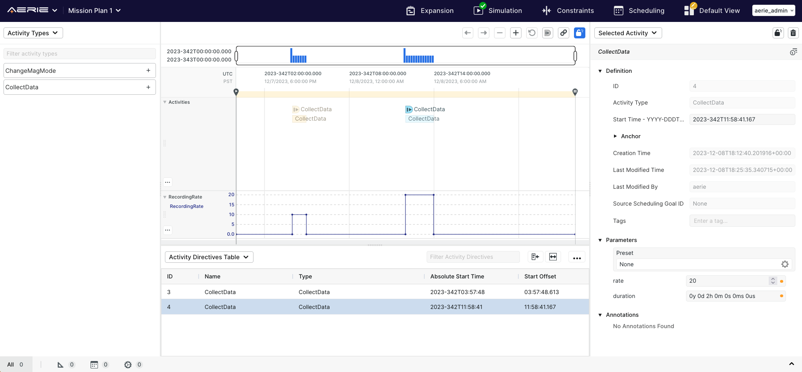
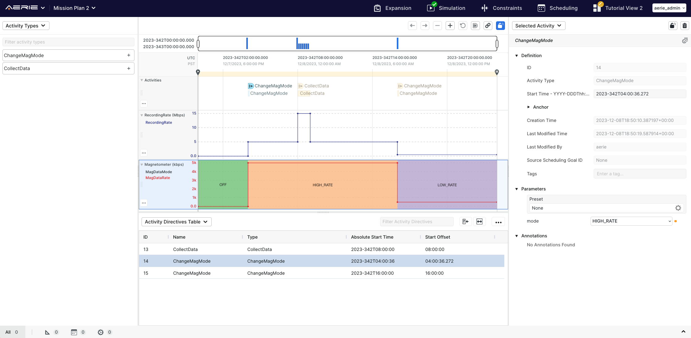

# Aerie Modeling Tutorial

This repo houses the simple on-board spacecraft solid state recorder model that you will build as part of Aerie's modeling tutorial.
While we recommend you go through the tutorial, this model also serves as an example you can use to jump start your own modeling efforts.
The model includes a resource that tracks recording rate and few different resources that show different ways in which you can integrate rate to get data volume over time.
A couple of different style data collection activities are also included to trigger recording rate changes.

## Outline
- Make sure you have access to an Aerie deployment (see FastTrack for a quick local install)
- Create new repo with mission model template (i.e. follow mission model template instructions) and make sure it compiles
  - With David's new framework, we should update this to account for his register in the Mission class
  - Also will need to update dependencies in build.gradle
  - Potentially suggest not including any activities/resources in the template...
- Create RecordingRate resource in a DataModel class
  - This will be a discrete resource
     + Briefly provide overview of a discrete resource
     + Note we will be talking about polynomial resources later
  - Register resource to UI
- Create simple CollectData activity for a camera
  - 2 parameters (duration, rate)
  - Show simple approach to changing rate (increase/delay/decrease)
     + Briefly talk about effects, non-consumable vs. consumable, why using "set" is not the best option
     + Note the non-consumable approach that could hae been used to produce the same result (using clause)
  - Make sure to note how the package-info has to be updated
- Compile and load model into Aerie for a first look
  - Create a couple collect data activities (maybe overlapping) to see more interesting effect
  - Simulate
  - 
- Create a second resource to tracks different data collection modes for a magnetometer that continuously collects data
  - Create enumeration class that maps mode to data rate
  - Create discrete state resource
- Create simple activity, ChangeMagMode, to change instrumentB mode, which in turn will change its data rate
  - This shows how you can get the current value of resource and use it for computation
- Introduce a derived resource for showing just the mag data collection rate instead of the total recording rate
- Compile and load the model into Aerie again for a second look
  - Put both types of activities in plan and see how it changes the two rate resources and how mode is tracked
  - 
- Create SSR volume resource
  - Talk about the various methods for integrating
  - Method 1 - Increase volume at end of activity

  - Method 2 - Increase volume across fixed number of steps within the activity

  - Note why these methods get more challenging with a mode based approach (integral is being tracking in the activity class and therefore activity needs to get track of the time since the mode changed, which isn't really something an activity should know/care about)

  - Method 3 - Reaction based approach

  - Method 4 - Daemon approach

  - Method 5 - Polynomial resource

- Create downlink activity that decreases recording rate at some point for more interesting looking plots

- How to show decomposition?? Maybe a calibration that decomposes into CollectData?

- Update Rate/SSR_Volume to Unit Aware Resources

- Show setting up tests (unit/simulation)

- Simple validation check (max collection rate?)
